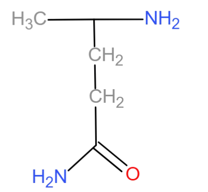

# Lifecycle of a Neurotransmitter
## Small Molecule Neurotransmitter
* They’re synthesized right at the axon terminal, packed into vesicles, and positioned **close to the active zone** of the synapse. This closeness results in them needing a **relatively small Ca²⁺ influx** to trigger vesicle fusion and release.
* After usage , the SM Nt can either :
	* Diffuse away from the synaptic cleft
	* Degraded by certain enzymes , then some are discarded and some (precursors) return inside the neuron 
	* Stored in glial cells ( astrocytes)  then reintroduced to the neuron , (check the glutamate eg for details [[#^19e4d0]])
***
## Peptide Nt
* They’re synthesized in the cell body, processed through the endoplasmic reticulum like any other protein, then packaged into vesicles and shipped down the axon. Along the way, they can undergo cleavages or modifications.
* When they finally reach the terminal, they just kind of hang out, not tightly docked like small molecule NTs. That means they sit farther from the active zone, so it takes a larger Ca²⁺ influx to trigger their release. ^4210be
* After their usage they can either :
	* Diffuse away from the synaptic cleft
	* Cleaved by proteases enzymes found in the cleft 

***
***
## Examples 
### Glutamate 
^19e4d0
* Glutamate is derived from a substance called **glutamine** basically via the action of an enzyme called glutaminase (substitution of  the amide group with hydroxyl)
* Once the glutamate is formed it gets stored into vesicle and released into the synaptic cleft
* After release it can :
	* diffuse away 
	* Re-enters the neuron for recycling 
	* enters nearby glial cells (astrocytes) in which it get transformed back into glutamine via the action of an enzyme called **glutamine transferase** 
		* Glutamine is then shipped back to the neuron 
		
### Acetylcholine 
^fd84f3
* Acetylcholine is derived from two precursors : **Acetyl CoA** (derived from pyruvate from glucose) & **Choline** , these two precursors are fused under the action of an enzyme called **Choline acetyltransferase** 
* Once acetylcholine is formed it is packed into vesicle and released into the synaptic cleft 
* After release it can :
	* Diffuse away 
	* gets transformed into **acetate** & **choline**, under the action of the enzyme **acetylcholinesterase** 
		* Acetate is discarded and choline is shipped back to the neuron 
		

***
***
## Gallery 

***

***
> *FIGURE 6.10* **Synthesis, release, and reuptake of the inhibitory neurotransmitters GABA and glycine.**
> (A) GABA is synthesized from glutamate by the enzyme glutamic acid decarboxylase, which requires pyridoxal phosphate. (B) Glycine can be synthesized by several metabolic pathways; in the brain, the major precursor is serine. High-affinity transporters terminate the actions of these transmitters and return GABA or glycine to the synaptic terminals for reuse, with both transmitters being loaded into synaptic vesicles via the vesicular inhibitory amino acid transporter (VIAAT).