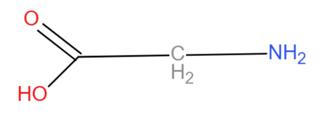

# Small Molecule Neurotransmitters
## Amino acids
These small molecules are responsible for rapid firing up of synaptic circuits 
### Glutamate 
* This is considered the holy grail of fast excitatory synapses Nts [[Lifecycle of a Neurotransmitter#^19e4d0]] 
	
### Aspartate 
* tiok 
### GABA
* short for gamma amino butyric acid, a famous very important inhibitory Nt originated from Glutamate [[]]
### Glycine 
* cute important Nt that mediates synapse inhibition in the spinal chord , it also can act as a cotransmitter for synapses that incorporate glutamate 
## Acetylcholine 

^3e601b

* Posses an important role in/out of the CNS, it has a very interesting production mechanism [[Lifecycle of a Neurotransmitter#^fd84f3]] 
	* In: in the brain, it tends to have more of a modulatory role especially in cognitive functions like attention 
	* Out: It is an excitatory Nt, it is mainly responsible for muscular contraction [[mouvement st]] 
	

***
***

## Biogenic Amines
These small molecules are rather responsible for modulation and allready existing circuit of synapses  
#### Catecholamines 
##### Dopamine
* The star, it controls many critical tasks in the nerveous system, to count few of the many : 
	* Modulates movement in the basal ganglia 
	* Takes part in circuit activation in the prefrontal cortex
	* Important role in motivation reward systems 
	
##### Epinephrine 
* interesting name 
#### Norepinephrine
* Very important in cognitive functioning , paying attention : release of norepinephrine + acetylcholin [[#^3e601b]]

***
#### Indoleamine 
##### Serotonin
* Heavily impacts ,in relation with dopamine , the psychiatric state of the body 
	==> Psychiatric drugs are based on manipulating the activity of this couple 

***

#### Imidazoleamine 
##### Histamine 
*  
