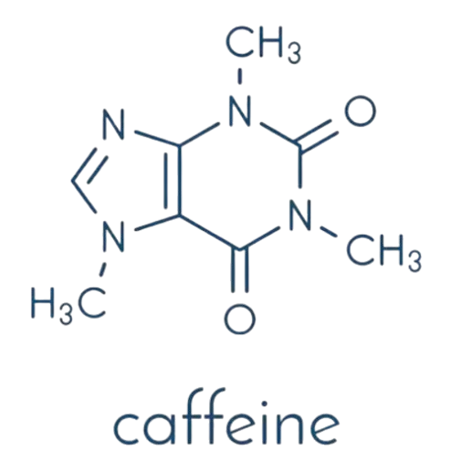
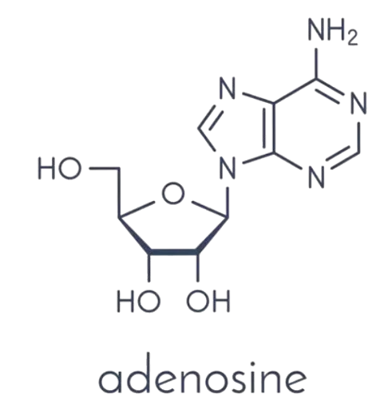

# Unconventional Neurotransmitters
## Intro 
These are Nt that are still not quite understood, and are quite bizzare in structure 

## ATP
* Yes , the all type star energy currency of living organisms , turned out to actually be a neurotransmitter , well not in the classical fashion , like it does not get encapsulated in vesicle (most of the cases) , but rather it simply get released into the cleft then it gets metabolized (in the cleft) and adenosine is free and is fixed on receptors in the hypothalamus that are associated with fatigue ! 
	==>the body uses its own energy source consumption source as an feedback tool for fatigue and exhaustion of the system !
* Blocking hypothalamus receptors with a possible substance could prevent adenosine fixation thus inhibiting fatigue : caffeine 
	-->Throwing off this highly curated *fatigometer* by caffeine does no good, overall good

***
## Endocannabinoids 
derived from membrane lipids (hydrophobic) substance found in  *cannabis sativa* , these are substance that has receptors associated with the cerebral cortex system , brain reward systems , generally effects on cognition and sensory motor system , also synaptic plasticity 

## Nitric oxide 
NO (1N+1O) is a gas made from **arginine** via a Ca²⁺regulated process Once produced, nitric oxide can act on nearby cells or directly on membrane-bound targets like **guanylyl cyclase**, an enzyme that results in cascades that governs vasodilation, neurotransmission, and more.

> Viagra and similar compounds work by hijacking the downstream effects of **nitric oxide**—basically manipulating how NO modulates vascular tone and smooth muscle relaxation. 